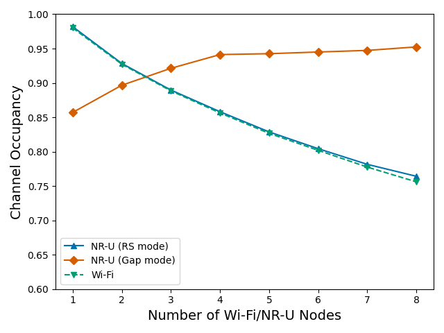
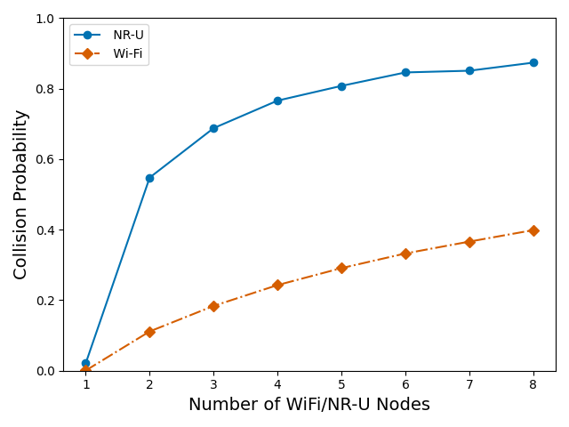
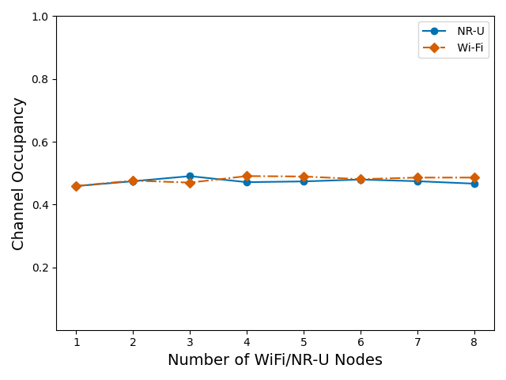

# 5G NR-U and Wi-Fi Coexistence Simulator

A SimPy-based simulation framework for analyzing the coexistence mechanisms between 5G NR-U (Unlicensed) and Wi-Fi networks in shared spectrum bands.

## Features

- **Parameter Sweeps**: Sweep nodes, contention window (CW) sizes, and synchronization parameters.
- **Modes of Operation**: Supports NR-U "gap" and "rs" (reservation signal) modes.
- **Comprehensive Metrics**: Measures channel occupancy, efficiency, collision probability, and network fairness.
- **Visualization Tools**: Automated scripts to generate comparative plots (e.g., efficiency vs. node count).
- **Flexible Configuration**: CLI-driven simulations with customizable parameters (CW ranges, retry limits, MCS, etc.).

## Installation

1. **Clone the repository**:
   ```bash
   git clone https://github.com/your-username/coexistence-simulator.git
   cd coexistence-simulator
   
2. **Install dependencies:**:
   ```bash
   pip install simpy pandas matplotlib click scipy
   ```
   or

   ```bash
   pip install -r requirements.txt

## Usage

### Running Simulations

1. **Sweep Wi-Fi/NR-U Nodes (Coexistence):**
```bash
python coexistence_node_sweep.py --start_node_number 1 --end_node_number 10 --nru_mode gap --min_sync_slot_desync 0 --max_sync_slot_desync 1000
```

2. **Contention Window (CW) Sweep:**
```bash
python contention_window_sweep.py --cw_start 32 --cw_end 512 --cw_step 48 --ap_number 2 --gnb_number 2
```

For detailed parameter explanations, use --help with any ```*_node_sweep.py``` script for example:
```bash
python coexistence_node_sweep.py --help
```
#### Example Output:
```bash
Usage: coexistence_node_sweep.py [OPTIONS]

Options:
  -r, --runs INTEGER                 Number of simulation runs (default: 10)
  --seed INTEGER                     Seed for simulation (default: 1)
  --start_node_number INTEGER        Starting number of nodes (required)
  --end_node_number INTEGER          Ending number of nodes (required)
  --simulation_time FLOAT            Simulation duration in μs (default: 100.0)
  --min_wifi_cw INTEGER              Wi-Fi minimum contention window (default: 0)
  --max_wifi_cw INTEGER              Wi-Fi maximum contention window (default: 0)
  --wifi_r_limit INTEGER             Wi-Fi retry limit (default: 3)
  --mcs_value INTEGER                MCS value (default: 7)
  --min_nru_cw INTEGER               NR-U minimum contention window (default: 0)
  --max_nru_cw INTEGER               NR-U maximum contention window (default: 0)
  --synchronization_slot_duration INTEGER
                                     Sync slot duration in μs (default: 1000)
  --max_sync_slot_desync INTEGER     Max gNB desync in μs (default: 1000)
  --min_sync_slot_desync INTEGER     Min gNB desync in μs (default: 0)
  --nru_observation_slot INTEGER     NR-U observation slots (default: 3)
  --mcot INTEGER                     Max NR-U channel occupancy time (ms) (default: 6)
  --nru_mode [rs|gap]                NR-U mode: 'rs' or 'gap' (default: gap)
  --help                             Show this message and exit.
```

### Analyzing Results
#### Generate comparative plots from simulation data:
```bash
# Compare NR-U modes (gap vs. rs)
python analyze_simulation_results.py

# Visualize CW impact on airtime fairness
python visualize_cw_impact.py

# Generate individual metric plots (e.g., channel occupancy)
python visualize_network_metrics.py
```
#### Outputs:
- Simulation data: output/simulation_results/
- Plots: output/metrics_visualizations/

#### Results Examples
## Example Results
| Metric                | Description                                  | Visualization Example                          |
|-----------------------|----------------------------------------------|------------------------------------------------|
| **Channel Occupancy** | Fraction of time the channel is occupied     |  |
| **Collision Probability** | Likelihood of overlapping transmissions |  |
| **Airtime Fairness**  | Impact of CW adjustments on fairness         |  |
