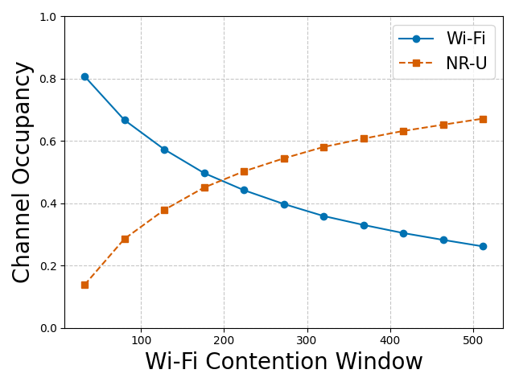

# 5G NR-U and Wi-Fi Coexistence Simulator

A SimPy-based simulation framework for analyzing the coexistence mechanisms between 5G NR-U (Unlicensed) and Wi-Fi networks in shared spectrum bands.

## Features

- **Parameter Sweeps**: Sweep nodes, contention window (CW) sizes, and synchronization parameters.
- **Modes of Operation**: Supports NR-U "gap" (listen-before-talk) and "rs" (reservation signal) modes.
- **Comprehensive Metrics**: Measures channel occupancy, efficiency, collision probability, and network fairness.
- **Visualization Tools**: Automated scripts to generate comparative plots (e.g., efficiency vs. node count).
- **Flexible Configuration**: CLI-driven simulations with customizable parameters (CW ranges, retry limits, MCS, etc.).

## Installation

1. **Clone the repository**:
   ```bash
   git clone https://github.com/your-username/coexistence-simulator.git
   cd coexistence-simulator
   
2. **Install dependencies:**:
   ```bash
   pip install simpy pandas matplotlib click scipy
   ```
   or

   ```bash
   pip install -r requirements.txt

## Usage

### Running Simulations

1. **Sweep Wi-Fi/NR-U Nodes (Coexistence):**
```bash
python coexistence_node_sweep.py --start_node_number 1 --end_node_number 10 --nru_mode gap --min_sync_slot_desync 0 --max_sync_slot_desync 1000
```

2. **Contention Window (CW) Sweep:**
```bash
python contention_window_sweep.py --cw_start 32 --cw_end 512 --cw_step 48 --ap_number 2 --gnb_number 2
```

3. **Wi-Fi-Only or NR-U-Only Simulations:**
```bash
# Wi-Fi-only sweep
python wifi_node_sweep.py --start_node_number 1 --end_node_number 10

# NR-U-only sweep (gap mode)
python nru_node_sweep.py --nru_mode gap --start_node_number 1 --end_node_number 10
```
### Analyzing Results
#### Generate comparative plots from simulation data:
```bash
# Compare NR-U modes (gap vs. rs)
python analyze_simulation_results.py

# Visualize CW impact on airtime fairness
python visualize_cw_impact.py

# Generate individual metric plots (e.g., channel occupancy)
python visualize_network_metrics.py
```
#### Outputs:
- Simulation data: output/simulation_results/
- Plots: output/metrics_visualizations/

#### Results Examples
## Example Results
| Metric                | Description                                  | Visualization Example                          |
|-----------------------|----------------------------------------------|------------------------------------------------|
| **Channel Occupancy** | Fraction of time the channel is occupied     |  |
| **Collision Probability** | Likelihood of overlapping transmissions |  |
| **Airtime Fairness**  | Impact of CW adjustments on fairness         |  |
